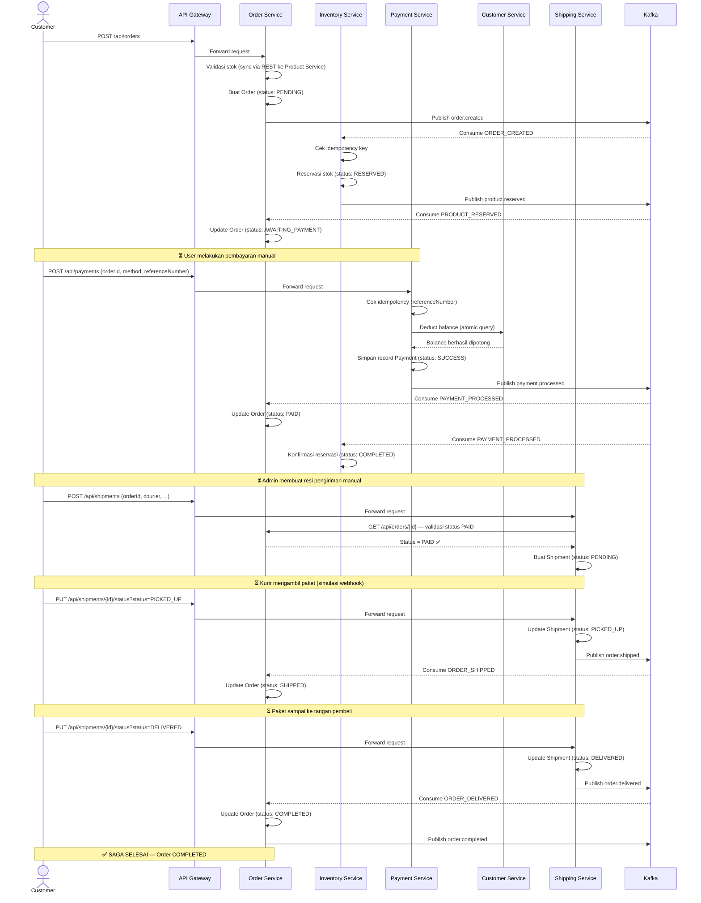
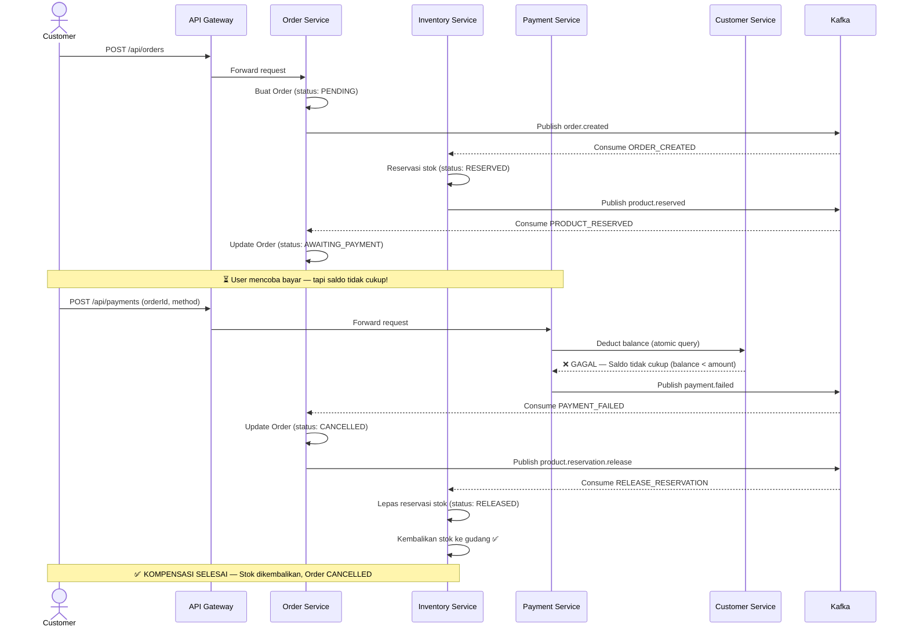
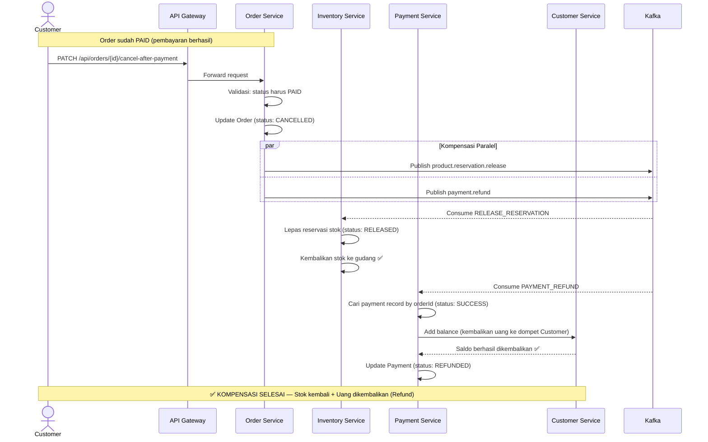
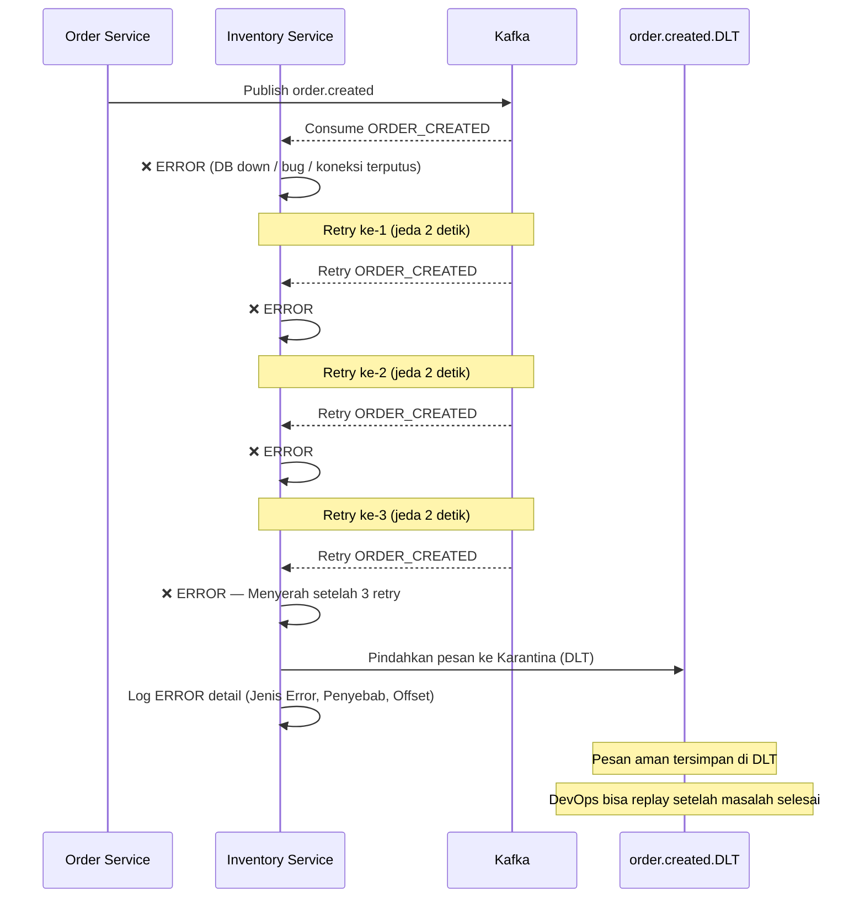

# Saga Choreography — Sequence Diagrams

## 1. Happy Path (Alur Sukses Penuh)

---

## 2. Compensation Path 1 — Saldo Tidak Cukup (Payment Failed)

---

## 3. Compensation Path 2 — Batal Setelah Bayar (Cancel + Refund)

---

## 4. Compensation Path 3 — DLQ (Consumer Gagal Proses)

